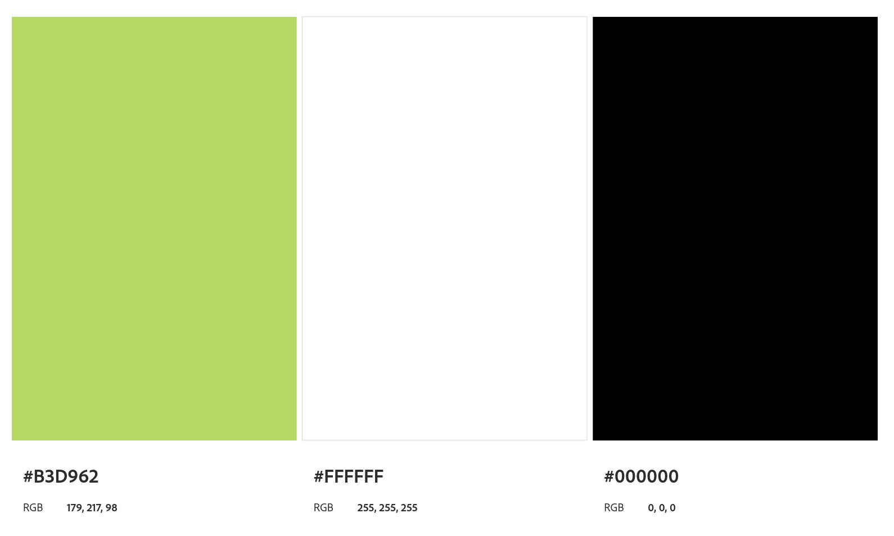
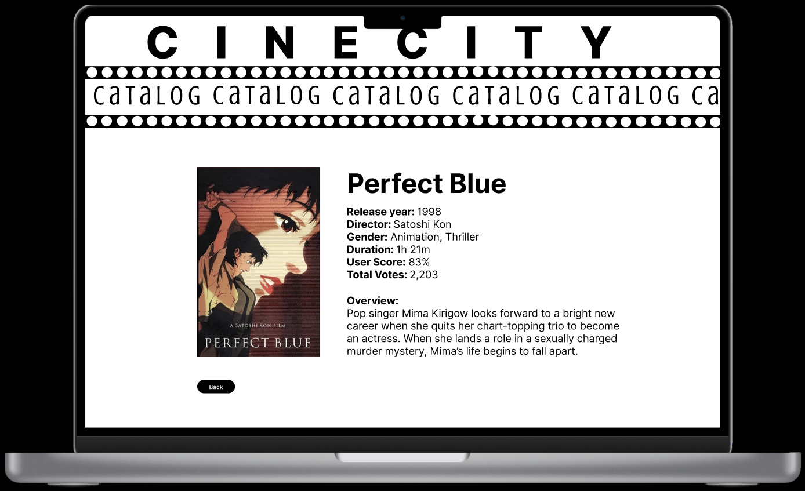
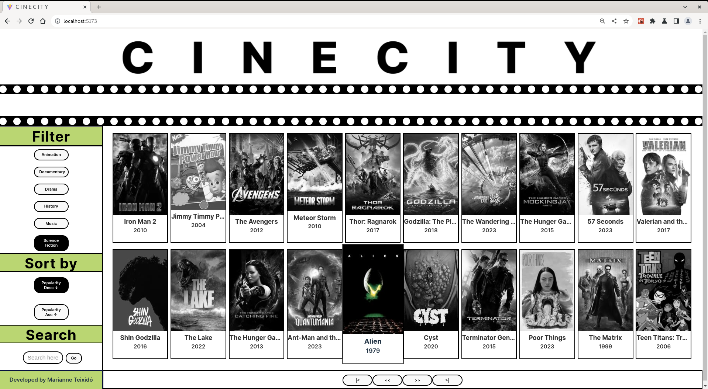
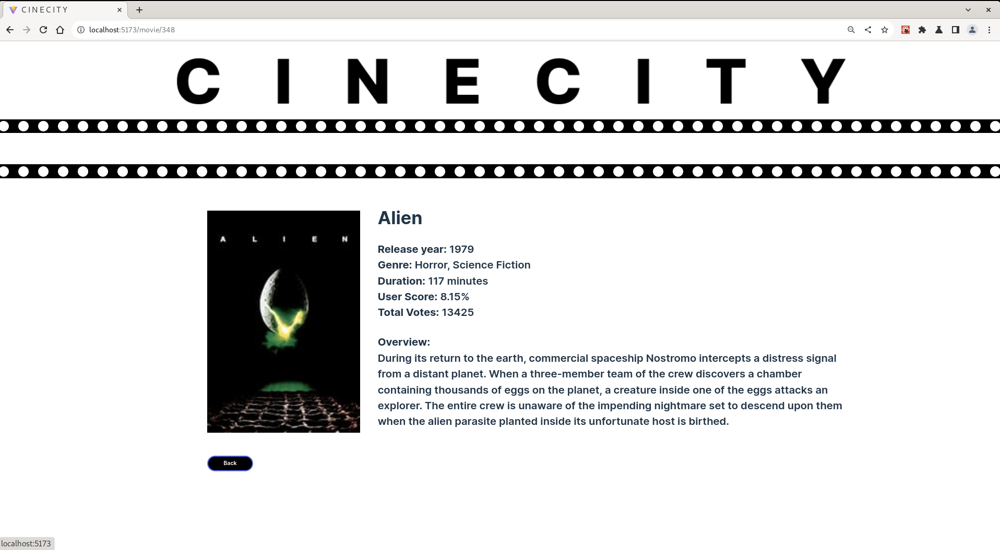

Cinecity is a web application that allows you to view, sort and filter a film catalog using the API from [The Movie Database](https://developer.themoviedb.org/docs). The design of the interface, search and ordering is inspired by websites focused on author cine programming and art cine such as the page of the [Cineteca Nacional](https://www.cinetecanacional.net/#gsc.tab=0) y [Ambulante](https://www.ambulante.org/).

## Table of contents

- [1. Features](#1-features)
- [2. Technology Stack](#2-technology-stack)
- [3. Design and prototype](#3-design-and-prototype)
- [4. Planned Features](#4-planned-features)
- [5. Credits](#5-credits)
- [6. License](#6-license)

## 1. Features

### Filters

This project allows you to filter using the following genres.

- Animation
- Documentary
- Drama
- History
- Music
- Science Fiction

### Sort

It is also possible to order with _endpoint_ configured in the following way.

- Ascending popularity
- Descending popularity

### Pagination

It is possible to navigate the content of the catalog using the minimalist page displayed at the bottom of the page.

## 2. Technology Stack

_Cinecity_  was developed using the following technologies.

### React
React was the core framework used to structure and build the frontend of _Cinecity_. It facilitated the creation of custom components, services, and modules that formed the user interface. React's routing system was used to manage navigation between different parts of the application, enabling seamless transitions and user interactions.

### TypeScript

TypeScript was the primary programming language used to write the frontend code. It added strong typing to the application, catching errors during development and providing better code quality and maintainability. It was instrumental in defining the data models, logic, and interactions within _Cinecity_.

### CSS

 CSS was employed to style the user interface of _Cinecity_. 

## 3. Design and prototype

The combination of color palette and typefaces in Cinecity seeks to achieve a clean, simple, minimalist and user-friendly look.  The green color brings energy to draw the user to the key elements of the app, while the black and white colors maintain legibility and simplicity. The choice of typefaces balances style with clarity, ensuring the website is attractive and functional.

### Color palette

Cinecity's design is characterized by the use of monochromatic colors with a touch of vibrant green that provides a modern, clean and simple user experience.

### Fonts

Cinecity uses [Inter](https://fonts.google.com/specimen/Inter) typography selected to achieve a balance between legibility and style. 

### Figma Prototype

A high fidelity desktop prototype was designed to anticipate the user experience. Design available here: [Figma Interactive Mobile Prototype](https://www.figma.com/proto/kTJrCzbPjF297eXNZSBqbg/cinecity?node-id=10-49&scaling=scale-down&page-id=0%3A1&mode=design&t=yhiRWCrzTZVwxCE8-1)

Web version of the high-fidelity prototype design:

## 4. Planned Features

This desktop app is a first version and is in the process of improving the experience. Future versions will add exciting enhancements such as; 

- Responsive version. 
- Numeric pagination.
- User profiles.
- Playlists. 

## 5. Credits

Project developed by Marianne Teixidó as part of the web development bootcamp in [Laboratoria](https://www.laboratoria.la/)

## 6. License 

[GNU General Public License v3.0](LICENSE.MD)